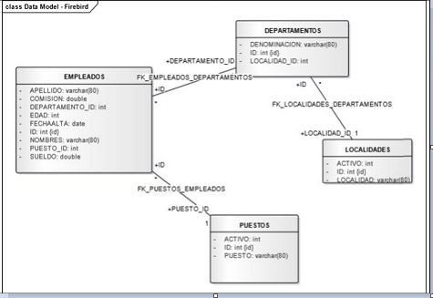

# Algoritmos en JavaScript
En esta sección encontrarás una serie de ejercicios de programación que forman parte de nuestra prueba técnica. 

En el archivo `index.js`, se detallan los ejercicios junto con las instrucciones y ejemplos de entrada y salida esperados. 

Para verificar tu progreso, podrás correr los siguientes comandos:
```bash 
   npm install /* Solo una vez */
   npm test
```

# Consultas SQL
Dada la siguiente base de datos relacional. 
Resuelva las siguientes consultas SQL.
Las mismas las deberás realizar en el archivo `consultas.sql`.



1. **Empleados ordenados alfabéticamente (Z...A):**  
   Muestra los nombres de los empleados en orden alfabético descendente.

2. **Empleados de Soporte:**  
   Muestra el nombre, el puesto y la localidad de los empleados con el puesto de 'Soporte'.

3. **Nombres que terminan con 'o':**  
   Lista los nombres de los empleados cuyo nombre termina con la letra 'o'.

4. **Empleados en Carlos Paz:**  
   Muestra el nombre, sueldo y localidad de los empleados que trabajan en la localidad Carlos Paz.

5. **Sueldos entre 10000 y 13000:**  
   Muestra el nombre, sueldo y localidad de los empleados cuyo sueldo se encuentra entre 10000 y 13000.

6. **Departamentos con más de 5 empleados:**  
   Visualiza los departamentos que tienen más de 5 empleados.

7. **Empleados en Córdoba con puesto de Analista o Programador:**  
   Muestra los nombres de los empleados que trabajan en Córdoba y tienen el puesto de 'Analista' o 'Programador'.

8. **Sueldo medio de todos los empleados:**  
   Calcula el sueldo medio de todos los empleados.

9. **Máximo sueldo en el departamento 10:**  
   Muestra el máximo sueldo de los empleados del departamento 10.

10. **Sueldo mínimo en el departamento Soporte:**  
    Calcula el sueldo mínimo de los empleados del departamento 'Soporte'.

11. **Suma de sueldos por puesto:**  
    Calcula la suma de sueldos para cada puesto.
